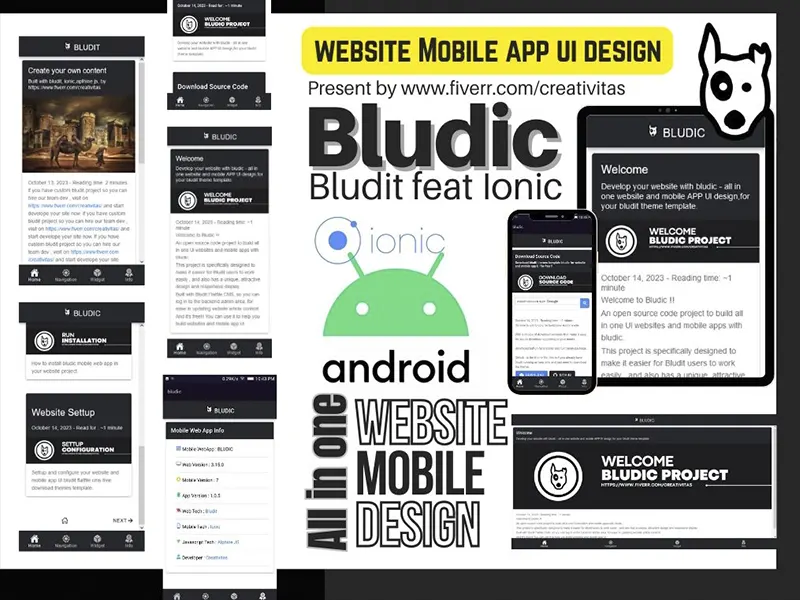

# BLUDIC PROJECT

Built all in one website and mobile app UI with bludit ionic BLUDIC Project.

A project present by [https://www.fiverr.com/creativitas/](https://www.fiverr.com/creativitas/)

A project present by [https://www.fiverr.com/creativitas/](https://www.fiverr.com/creativitas/)

Demo : [https://axcora.my.id/bludit/bludic/](https://axcora.my.id/bludit/bludic/)

Pro version : [https://bludit.axcora.com/bludicpro/](https://bludit.axcora.com/bludicpro/)

Bludic Home [https://bludit.axcora.com/bludic/](https://bludit.axcora.com/bludic/)

---

### Convert to android app run demo : 
+ [Download android app Free version](bludic/android/bludic.apk) 
+ [Download android app Pro version](bludic/android/bludicpro.apk) 
+ Android phone setup : Click on Settings - App Management Special app access - Install from unknown apps - select Bludic App

---

### Demo Video
+ [Installation Video](https://youtu.be/KrqWxTaQXDk)
+ [Work with mobile browser](https://www.youtube.com/watch?v=MG2rkQGc44I)
+ [Work with Android App](https://www.youtube.com/watch?v=m7_iorDBPfM)
+ [Installation PRO Video](https://www.youtube.com/watch?v=7I9vlX_OwhM)
+ [Work with mobile browser PRO Version](https://www.youtube.com/watch?v=S0rdBKYl7lM&t=64s)
+ [Work with Android App PRO Version](https://www.youtube.com/watch?v=BEEUzdrbq5M)

---

### Installation on bludit project

+ Download source code - and upload on your project/bl-themes
+ Logon on your admin panel - click on themes and activate bludic template.

---

### Install with full package

+ For installation complete package set you can [download in here →](creativitaz.gumroad.com/l/bludicfree)
+ Upload and extract source code file on your host
+ Visit your web and run installation

